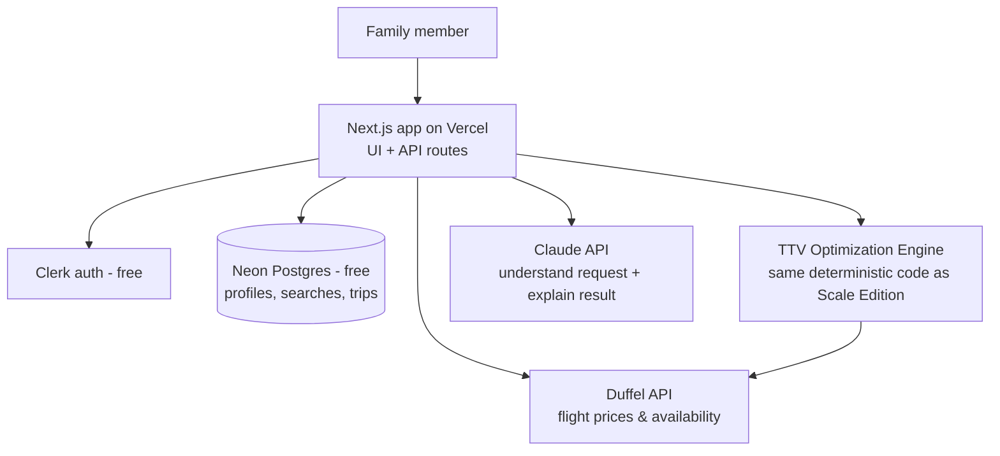

# Hiddenwing — Family Edition (the plan we're actually building first)

_Status: **ACTIVE PLAN** · Owner: You · Last updated: 2026-07-22_

> **Read this first.** The rest of `/docs` describes the full "world-class platform serving
> millions" — that's our **North Star (Scale Edition)**, kept intact so we can grow into it. But
> **right now we are building the Family Edition**: the same great product, for 2–10 people
> (family + friends), at **near-zero cost and near-zero ops**. Maximum quality, minimum spend.
>
> **The core idea:** keep the one thing that makes Hiddenwing special — the personalized
> optimization and grounded AI — and cut everything that only exists to serve millions of strangers
> (big infrastructure, compliance, a whole team). Because we build on the *same technologies* as the
> Scale Edition, growing up later is **adding pieces, not rewriting.**

---

## 1. What the Family Edition is (and isn't)

**Is:** a private web app your family logs into, describes a trip in plain language, and gets a
personalized, explained "best trip for you" ranking — the real product, just small.

**Isn't:** a public service. No strangers, no signups from the internet, no payments, no
company-scale infrastructure. That distinction is what makes it cheap and legally simple.

## 2. What we keep vs. what we cut (and why it's safe)

### ✅ Keep — this is the "maximum quality" part, and it's basically free
| Keep | Why |
|---|---|
| **The TTV optimization engine** (personalized ranking by price+time+comfort+preference) | It's the actual product value — and it's just *code*, it costs nothing to run |
| **AI at the edges, grounded** (Claude understands your request + explains results, never invents prices) | The trust feature; a coding discipline, not a cost |
| **Preference profiles** per family member | Cheap, and it's the magic ("Dad hates red-eyes, Mum wants aisle") |
| **Clean architecture + same tech as Scale Edition** | So growing up is additive, not a rewrite |
| **Flexibility search** (nearby airports, ± a few days) | The feature that beats a plain search |

### ✂️ Cut for now — only needed at large scale, add later when/if it earns it
| Cut | Why it's safe to skip for 2–10 people |
|---|---|
| Multi-provider mesh + failover | One flight-data source is plenty for a family |
| Async job queue + progressive streaming (SQS, Valkey Streams) | No concurrency problem at family volume — synchronous is fine |
| Redis/Valkey caching | Not needed; the database handles it |
| AWS + Kubernetes + Terraform | Use free managed hosting with **zero ops** |
| GDPR / DPIA / seller-of-travel / legal review | **Private family use isn't a public data-processing service** (see §7 caveat) |
| Experimentation platform, SLOs, on-call, observability stack | Overkill for a handful of trips a month |
| Subscriptions / payment processing | You book on the airline's own site; we take no money |
| SEO, growth, B2B, competitive strategy | Irrelevant until it's a public product |

## 3. The Family Edition stack (everything free-tier or pay-pennies)

| Category | Family Edition (now) | Monthly cost | Grows into (Scale Edition) |
|---|---|---|---|
| **App** | One **Next.js** app (UI + API routes, TypeScript) | $0 | Split into Next.js UI + NestJS/FastAPI services (docs 07, 24) |
| **Hosting** | **Vercel** free tier | $0 | AWS Fargate → EKS (doc 24) |
| **Database** | **Neon** or **Supabase** (serverless Postgres, free tier) | $0 | AWS RDS/Aurora (doc 09, ADR-0005) |
| **AI** | **Anthropic Claude API** direct — Haiku (cheap) + Sonnet (quality) | ~$1–5 | Claude via Bedrock for EU residency (doc 24) |
| **Flight data** | **Duffel** (sandbox free; pay-per-use live) | ~$0 | + a GDS, multi-provider mesh (doc 13) |
| **Auth** | **Clerk** free tier (or a simple magic-link) | $0 | Clerk paid → self-hosted Ory (doc 24) |
| **Caching** | none (in-memory / Postgres) | $0 | Valkey (doc 24) |
| **Queue** | none (synchronous requests) | $0 | SQS + Valkey Streams (ADR-0008) |
| **Monitoring** | **Sentry** free + Vercel analytics | $0 | Grafana Cloud (doc 21) |
| **CI/CD** | **GitHub Actions** free → auto-deploy on Vercel | $0 | + Terraform, ArgoCD (doc 20) |
| **Payments** | none | $0 | Stripe / Paddle (doc 24) |
| **Domain** (optional) | e.g. a `.app` you like | ~$1/mo | same |
| **TOTAL** | | **≈ $0–15/mo** | |

**Why these specific choices:** every one is either a free tier or pay-per-use at pennies, **and**
it's the *same technology family* as the Scale Edition. Next.js, Postgres, Claude, and Duffel don't
change when you grow — you just add the heavier pieces around them. That's the "easily switch later"
promise, kept.

## 4. Simplified architecture (one app, one database, two APIs)

Compare this to the [full System Architecture](architecture/06-system-architecture.md): it's the
*same shapes*, just collapsed into one deployable with the optional heavy parts removed. When you
scale, you pull them back apart along the seams the Scale Edition already documents.

## 5. Solo-build roadmap (realistic for one person, part-time)

No team, no salaries — just your time. Rough sequence:

1. **Setup (a weekend):** create the Next.js app, deploy to Vercel, connect Neon Postgres and Clerk.
   You have a logged-in "hello world" for free.
2. **Flight search (1–2 weeks):** integrate the Duffel sandbox; a simple structured search form for
   one route returns real flight options.
3. **The valuable core (2 weeks):** build the **TTV optimization engine** + Comfort Score — rank
   results by *your family's* definition of value, not just price. This is the fun part and the
   whole point.
4. **AI layer (1 week):** add Claude for natural-language trip requests and grounded "why this
   trip" explanations.
5. **Personalization (1 week):** preference profiles per family member; flexibility search (nearby
   airports, ± a few days).
6. **Use it for real:** plan an actual family trip with it, see what's annoying, improve.

That's a working, genuinely useful tool in roughly **6–8 part-time weeks**, for a few dollars a
month.

## 6. What it costs — the honest bottom line

- **To build:** your time (evenings/weekends). $0 in wages.
- **To run:** **≈ $0–15/month**, dominated by tiny Claude API usage; hosting, database, and auth
  are all free at family scale; Duffel is free to test and pay-per-use if you ever book through it.
- **One-off:** optionally ~$12/year for a domain. No legal fees, no deposits, no infrastructure
  spend.

The scary $70k–380k number from before was **salaries to hire a team** for the public platform —
it does not apply to a tool you build yourself for your family.

## 7. One honest caveat (privacy & "going public" later)

Building this for your own family is fine and doesn't trigger the GDPR/legal machinery in
[docs 15–16](security/15-security-architecture.md) — that applies to *public services processing
other people's data commercially*. Two sensible notes:

- Still be decent with your family's data: use the free managed services' security, don't log
  passwords, keep API keys out of the code (a `.env` file, not committed).
- **The moment you open signups to the public or take money, the Scale Edition's security, GDPR,
  and seller-of-travel work becomes required again.** That's the boundary. Until then, you're free
  and simple.

## 8. The upgrade path — why "switch to world-class later" is genuinely easy

If the family loves it and you want to grow it, you don't rewrite — you **add**, following docs
already written:

| To grow, add… | Documented in |
|---|---|
| Split the one app into UI + services | [Backend Architecture](architecture/07-backend-architecture.md), [ADR-0004](architecture/adr/0004-modular-monolith-first.md) |
| Caching (Valkey) + async search (SQS) | [Tech Stack §4–5](architecture/24-technology-stack-decisions.md), [ADR-0008](architecture/adr/0008-async-first-search.md) |
| Multiple flight providers + failover | [Data Providers](architecture/13-data-providers.md), [ADR-0002](architecture/adr/0002-multi-provider-adapter-strategy.md) |
| Move hosting to AWS, add observability | [Tech Stack §6](architecture/24-technology-stack-decisions.md), [Deployment](operations/20-deployment-strategy.md), [Observability](operations/21-observability-and-slos.md) |
| Security hardening, GDPR, payments, growth | [Security](security/15-security-architecture.md), [GDPR](security/16-gdpr-and-privacy.md), [Business Model](product/02-business-model-gtm.md) |

Because the Family Edition already uses the same core technologies and keeps the clean-architecture
boundaries, each of these is a **bolt-on**, and every one is pre-designed in the Scale Edition docs.
You get to start tiny and cheap, and the "big" version is waiting whenever you want it.

---
_Start here. Grow later only if it's worth it. Pay the minimum now, keep the quality, keep the door
open._
