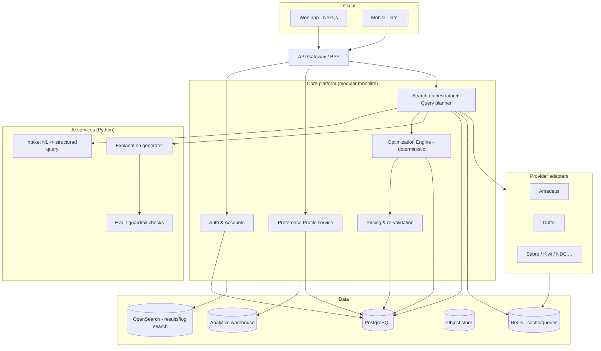
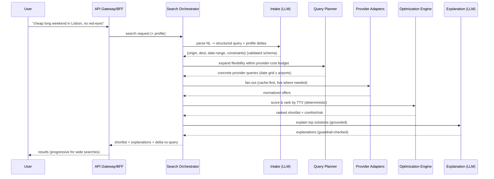

# 06 · System Architecture

_Status: Draft · Owner: Architecture · Last updated: 2026-07-22_

This is the whole system at a glance. Details are in the per-layer docs (07–14). Key decisions
are recorded as [ADRs](adr/).

## 1. Architectural principles

1. **Deterministic core, AI at the edges.** The optimization/pricing core is pure and testable;
   LLMs sit at intake (understanding) and output (explanation) only. (docs 10, 12)
2. **Provider-agnostic domain.** All GDS/aggregator specifics live behind adapter interfaces;
   the domain never imports a provider SDK. (doc 13, ADR-0002)
3. **Modular monolith first, extract services later.** Start as a well-bounded modular monolith
   plus a couple of specialized services; split along seams as scale demands. (ADR-0004)
4. **Async-first search.** Because provider calls run 2–10 s, search is async/progressive by
   default with a first-meaningful-result target; a cache-served sync fast lane is a narrow
   optimization, not the primary path. (NFR-1/2, review §2–3, [ADR-0008](adr/0008-async-first-search.md))
5. **Cache aggressively, book only on live prices.** (NFR-12/14)

## 2. High-level component view

## 3. Request flow — an interactive search

## 4. Technology choices (summary)

| Layer | Choice | Rationale (see linked doc / ADR) |
|---|---|---|
| Frontend | **Next.js (React, TS)** | SSR/SEO for the content wedge; one language across FE (doc 08) |
| API/Core | **TypeScript + NestJS** | Typed, structured, great DI for clean architecture (doc 07, ADR-0001) |
| AI services | **Python (FastAPI)** | ML/LLM ecosystem, eval tooling (docs 10–11) |
| Optimization | **TS/Rust-ready pure module** | Deterministic, hot-path; language chosen for perf if needed (doc 12) |
| Primary DB | **PostgreSQL** | Relational integrity for profiles/bookings; JSONB flexibility (doc 09, ADR-0005) |
| Cache/Queues | **Redis** | Fare cache, rate limiting, job queue (doc 09) |
| Search/log | **OpenSearch** | Result/log exploration, analytics |
| Messaging | **Redis Streams → Kafka later** | Simple first; Kafka when throughput demands (ADR-0004) |
| Infra | **Kubernetes on a major cloud, Terraform** | Portability, autoscaling (doc 20) |

## 5. Cross-cutting concerns
- **Security** — every boundary validates input; authn/authz centralized; secrets in a manager
  (doc 15).
- **Observability** — correlation IDs, tracing, RED/USE metrics, provider-cost metric (doc 21).
- **Multi-region readiness** — stateless services + regional data residency (docs 09, 16).

## 6. Why not the obvious alternatives
- **Full microservices from day one?** Premature — distributed complexity before we know the
  seams. Modular monolith gives clean boundaries now, easy extraction later (ADR-0004).
- **LLM does the ranking?** Rejected — non-deterministic, unexplainable, can hallucinate
  prices. Optimization is deterministic; LLM explains it (ADR-0006, doc 11).
- **One provider only?** Fragile and non-competitive on coverage/price; adapter pattern +
  multi-provider from early (doc 13, ADR-0002).
