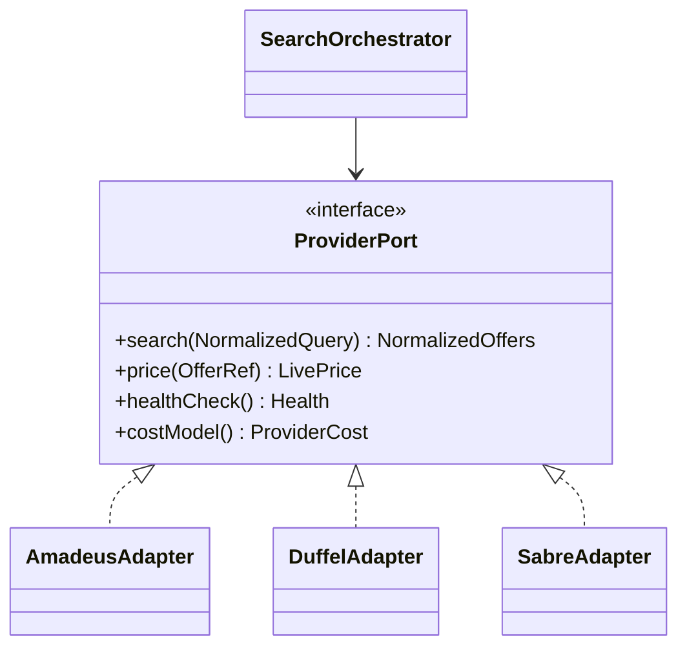
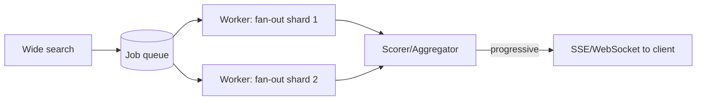

# 07 · Backend Architecture

_Status: Draft · Owner: Backend · Last updated: 2026-07-22_

## 1. Style: modular monolith + specialized services

We start as a **modular monolith** (TypeScript / NestJS) with strict module boundaries, plus a
small number of separate services where the runtime or scaling profile genuinely differs:

- **AI service** (Python/FastAPI) — different ecosystem, different scaling.
- **Optimization Engine** — a pure library today; extractable to its own service when the hot
  path needs isolation or a faster language (Rust) — see [doc 12](12-flight-search-optimization.md).

Rationale in [ADR-0004](adr/). This keeps early velocity high and distributed-systems overhead
low, while the module seams double as future service boundaries.

## 2. Clean architecture layering

Each module follows the same onion:

```
   ┌────────────────────────────────────────┐
   │  Interface (HTTP/GraphQL controllers)   │  <- validation, auth, serialization
   ├────────────────────────────────────────┤
   │  Application (use cases / orchestration)│  <- transactions, workflow
   ├────────────────────────────────────────┤
   │  Domain (entities, TTV, policies)       │  <- pure, no framework/provider imports
   ├────────────────────────────────────────┤
   │  Infrastructure (DB, providers, cache)  │  <- adapters implement domain ports
   └────────────────────────────────────────┘
```

**Dependency rule:** inward only. Domain knows nothing of NestJS, Postgres, or Amadeus. Providers
and repositories implement **ports** (interfaces) defined by the domain. This satisfies NFR-22
and makes the domain unit-testable without I/O.

## 3. Modules (bounded contexts)

| Module | Responsibility | Key ports |
|---|---|---|
| **Accounts & Auth** | Identity, sessions, OAuth, consent | `UserRepo`, `TokenService` |
| **Preference Profile** | Versioned profiles, weights, constraints | `ProfileRepo` |
| **Search Orchestration** | Intake → query planning → fan-out → assemble | `ProviderPort[]`, `Cache` |
| **Query Planner** | Expand flexibility within a provider-cost budget | `CostBudget`, `ProviderPort` |
| **Optimization Engine** | Deterministic TTV scoring & ranking | pure functions (no ports) |
| **Pricing** | Cache, live re-validation, price integrity | `ProviderPort`, `Cache`, `AuditLog` |
| **Booking Handoff** | Deep-link / (later) booking flow | `ProviderPort`, `AuditLog` |
| **Monitoring/Alerts** | Saved searches, price watch | `ProfileRepo`, scheduler |
| **AI Gateway** | Typed façade to the Python AI service | `NluClient`, `ExplainClient` |

## 4. Provider abstraction (critical)



Every provider is an adapter implementing `ProviderPort`. Adding/removing a provider never
touches domain code. Normalization to a common offer model happens **inside** the adapter. See
[Data Providers](13-data-providers.md) and ADR-0002.

## 5. Async-first search (revised per review §2/§3, [ADR-0008](adr/0008-async-first-search.md))

Provider search calls routinely run 2–10 s, so a blocking "sync ≤ 4 s full result" model is not
realistic for live multi-provider flexibility search. **The async/progressive path is the design
center**, not a special case:

- **Async path (default)** — request → enqueue job → providers fanned out concurrently (preferring
  provider-native flexible endpoints, doc 13 §4a) within a cost budget → results **stream** back
  (WebSocket/SSE) and are scored as they arrive. Target: **first meaningful result p95 ≤ 2 s**
  (NFR-1), full set progressively ≤ 10 s (NFR-1b). Backed by Redis Streams initially, Kafka at
  scale (ADR-0004).
- **Sync "fast lane" (narrow case only)** — narrow, exact-date queries that can be served from a
  contractually-permitted cache may answer synchronously. This is an optimization on top of the
  async path, **not** the primary flow, and is bounded by provider caching rights (doc 13 §0,
  legal review §5).



## 6. Pricing integrity flow (non-negotiable)

1. Search may use the **fare cache** (bounded TTL) for ranking speed — cached prices labeled.
2. Before **any** booking handoff, the Pricing module performs a **live re-validation** against
   the provider. If the price moved beyond tolerance, the user is re-quoted (FR-21, NFR-12).
3. Every quote, re-validation, and handoff writes to an **immutable audit log** (FR-31).

## 7. Cross-cutting
- **Validation** at every controller (schema-first, e.g. Zod/DTO) — input validation is a
  security control (doc 15).
- **AuthZ** via a central policy layer (RBAC now, ABAC-ready).
- **Idempotency keys** on any state-changing endpoint.
- **Rate limiting** per user + per IP at the gateway (Redis token bucket).
- **Observability** — correlation ID injected at the gateway, propagated to providers and the
  AI service (doc 21).

## 8. Tech stack
Node.js LTS · TypeScript · NestJS · Prisma/TypeORM (Postgres) · Redis · OpenSearch client ·
Python/FastAPI (AI) · OpenAPI + typed clients between services. API design in
[doc 14](14-api-strategy.md).

## 9. Rejected alternatives
- **Serverless-only core** — cold starts + provider connection pooling + long async searches
  make a container platform a better fit; serverless reserved for glue/edge.
- **GraphQL-everywhere internally** — REST/typed RPC between services is simpler to trace; BFF
  may expose GraphQL to the client (doc 08/14).
