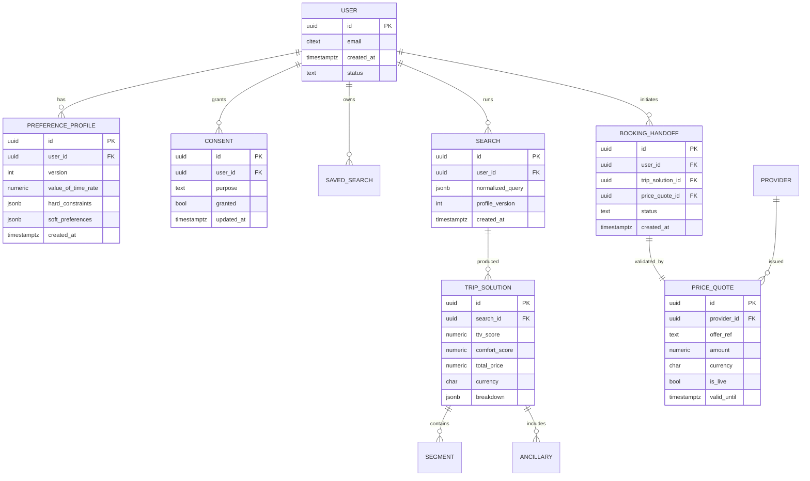

# 09 · Database Design

_Status: Draft · Owner: Backend / Data · Last updated: 2026-07-22_

## 1. Polyglot persistence — the right store per job

| Store | Used for | Why |
|---|---|---|
| **PostgreSQL** (primary) | Users, profiles, consents, saved searches, bookings/handoffs, audit log | ACID integrity for money/PII; JSONB for flexible preference blobs; mature, scalable (ADR-0005) |
| **Redis** | Fare cache, rate-limit counters, job queues, session/ephemeral | Sub-ms reads; TTL-native for bounded cache staleness (NFR-14) |
| **OpenSearch** | Result exploration, log/analytics search | Fast facet/aggregation over large result & log sets |
| **Object storage** (S3-class) | Raw provider payloads (debug), exports (DSAR) | Cheap, immutable, lifecycle-managed |
| **Analytics warehouse** (BigQuery/Snowflake/ClickHouse) | North-star metric, provider-cost analytics, funnels | Separate OLAP from OLTP; privacy-safe aggregates |

We **avoid** a document DB as primary: relational integrity for profiles/bookings/audit matters
more than schema fluidity, and Postgres JSONB covers the flexible parts (ADR-0005).

## 2. Core relational model (OLTP)

Design notes:
- **Preference Profile is versioned** (immutable rows, new version on change) → satisfies
  reproducible ranking (NFR-13) and gives the user an editable/auditable history (FR-13).
- **Search stores its `profile_version`** so a ranking can always be reconstructed.
- **PRICE_QUOTE.is_live + valid_until** enforce the "book only on live prices" rule; the
  handoff references the exact quote it was validated against (NFR-12).
- **Consents are per-purpose** and independently toggleable (FR-28, GDPR doc 16).

## 3. Audit log (append-only)
Immutable, hash-chained records of every price-affecting action (quote, re-validation, handoff)
and every profile change. Write-once (Postgres partitioned append-only table or a dedicated
ledger). Required by FR-31 / NFR-12 and useful for GDPR accountability.

## 4. Caching model (Redis)
- **Fare cache** keyed by `(provider, route, date, cabin, pax)` with short TTL; value carries
  `fetched_at`. Never used for the final bookable price without live re-validation.
- **Rate-limit** token buckets per user + per IP.
- **Job queue** (Redis Streams) for async wide searches (doc 07).
- **Idempotency keys** for state-changing endpoints.

## 5. Scaling strategy (toward 10M+ users, NFR-5)
- **Read replicas** for read-heavy profile/search reads.
- **Partitioning**: time-partition `SEARCH`, `TRIP_SOLUTION`, and audit tables; archive old
  partitions to object storage.
- **Connection pooling** (PgBouncer) — essential under bursty search load.
- **Sharding** by `user_id` is deferred until a replica+partition ceiling is hit (don't shard
  prematurely).
- **Hot/cold split**: recent data in Postgres, historical in the warehouse.

## 6. Data lifecycle, residency & privacy (GDPR)
- **Retention policies** per data class (search logs shorter than account data); automated
  purge jobs.
- **Right to erasure** propagates across Postgres, Redis, OpenSearch, object storage, and the
  warehouse (crypto-shredding for immutable stores) — see [doc 16](../security/16-gdpr-and-privacy.md).
- **Residency**: EU users' PII stored in EU region; NFR-18. Schema tags data class for
  region-aware handling.
- **Encryption**: at rest (AES-256) everywhere; column-level encryption for the most sensitive
  PII (doc 15).

## 7. Migrations & ownership
- Versioned, reviewed migrations (Prisma Migrate / Flyway); forward-only in production.
- Each bounded context owns its tables; cross-context access via APIs, not shared table reads
  (keeps future service extraction clean — doc 07).
