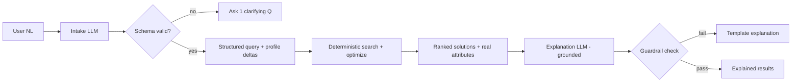

# 10 · AI Strategy

_Status: Draft · Owner: AI · Last updated: 2026-07-22_

## 1. The core rule

> **AI understands and explains. Deterministic systems decide and price.**

Per CLAUDE.md: AI must **not** replace deterministic systems where accuracy is required. Flight
pricing, availability, and ranking come from reliable data providers and the deterministic
[Optimization Engine](12-flight-search-optimization.md). The LLM never invents a price, a time, a
seat availability, or a ranking. This boundary is architectural, not a guideline (ADR-0006).

## 2. Where AI is used (and where it is not)

| Task | AI? | Notes |
|---|---|---|
| Natural-language trip intake (NL → structured query) | **Yes** | Output validated against a strict schema before use (FR-1) |
| Preference extraction ("I hate red-eyes") → profile deltas | **Yes** | User reviews/edits inferred changes (FR-12) |
| Explanation of a recommendation | **Yes** | Grounded strictly in the solution's real data (FR-19) |
| Follow-up Q&A on results | **Yes** | Answers only from system data (FR-20) |
| Travel-planning assistance / suggestions | **Yes** | Advisory, never auto-booking |
| **Pricing / availability** | **No** | Providers only (NFR-12) |
| **Ranking / TTV scoring** | **No** | Deterministic engine (NFR-13) |
| **Booking decisions** | **No** | Explicit user confirmation always required |

## 3. Architecture of the AI layer

Key properties:
- **Structured output / function-calling** with schema validation on intake — free text in,
  typed query out; invalid → clarify, never guess (FR-3).
- **Retrieval-grounded explanation**: the explanation prompt is given *only* the chosen
  solution's real attributes (price breakdown, times, comfort factors) and must reference those;
  a guardrail checks every number in the output exists in the source (doc 11).
- **Deterministic fallback**: if the LLM is slow, unavailable, or fails the guardrail, we fall
  back to the structured form (intake) and templated explanations (output). AI never blocks the
  core flow (NFR-4).

## 4. Model strategy
- **Managed LLM API** initially (fast to ship, strong quality). Provider-abstracted behind an
  `LlmClient` port so we can swap/route models (cost/quality/latency tiers).
- **Small/cheap models** for high-volume, low-complexity tasks (entity normalization,
  classification); **larger models** for nuanced planning/explanation.
- **Prompt + schema versioning** — prompts are versioned artifacts, evaluated before rollout
  (doc 11). No prompt ships without passing the eval gate.
- **Self-host / fine-tune** considered later only if cost or latency at scale justifies it
  (ADR to follow); not an MVP concern.

## 5. Cost & latency discipline
- LLM stays **out of the per-candidate hot path** (NFR-27) — it runs once per search at intake
  and once per shortlist at explanation, not per candidate solution.
- Cache intake parses for repeated/near-identical queries; cache explanation templates.
- Track tokens & $ per search as a first-class metric (doc 21; ties to
  [Business Model](../product/02-business-model-gtm.md) cost structure).

## 6. Data & privacy
- Minimize PII sent to the LLM; strip identifiers where possible.
- Respect user consent for any use of their data in personalization (GDPR doc 16).
- No training on user data without explicit, separate consent; managed-provider data-use terms
  reviewed and pinned to no-retention/no-training tiers.

## 7. Risks & mitigations (detail in doc 11)
| Risk | Mitigation |
|---|---|
| Hallucinated price/time in explanation | Grounding + numeric guardrail; templated fallback |
| Wrong preference extraction | User review/edit; eval-set accuracy gate |
| Prompt injection via user text or provider data | Treat all external text as untrusted; no tool/price authority granted to LLM (doc 11, 15) |
| Latency/outage | Structured path never depends on AI; timeouts + fallback |
| Cost blow-up | Edge-only usage, caching, model tiering, per-search budget |

## 8. Why not "let the LLM do it all"
An LLM-as-optimizer would be non-deterministic (breaks NFR-13), unexplainable in a debuggable
way, latency-heavy, expensive per candidate, and — worst — capable of fabricating a price the
user might book on. That single failure mode is existential for trust. Hence the hard boundary
(ADR-0006).
