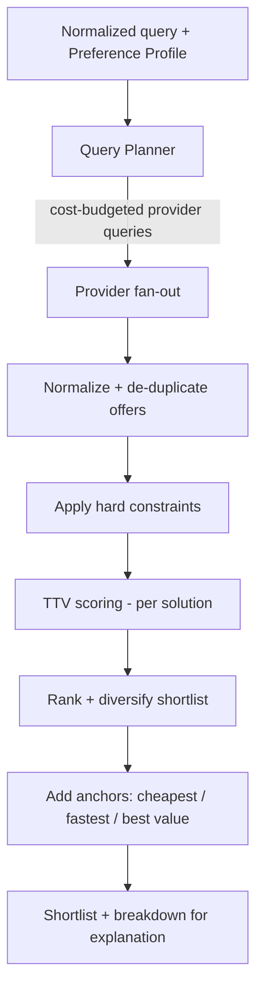

# 12 · Flight Search Optimization

_Status: Draft · Owner: Architecture / Optimization · Last updated: 2026-07-22_

This is the product's crown jewel: the deterministic engine that turns raw provider offers into a
personalized, explainable ranking by **Total Trip Value (TTV)**.

## 1. Problem statement
Given a traveler's constraints and Preference Profile, and a set of candidate Trip Solutions
sourced from providers across a *flexibility space*, produce a ranked shortlist maximizing TTV —
fast, deterministic, and explainable.

## 2. The pipeline



Every stage after fan-out is **pure and deterministic** (NFR-13): same inputs + profile version →
same ranking. No LLM, no network in the scoring path (NFR-3, NFR-27).

## 3. Query planning — searching the flexibility space affordably
The naive approach (every date × every nearby airport × every provider) explodes provider calls
and cost — the central scaling risk (see [Business Model](../product/02-business-model-gtm.md),
[Data Providers](13-data-providers.md)). The planner:
- Expands the **date grid** and **nearby airports** within user-set ranges (FR-5/6).
- Works within a **provider-cost budget**: prioritizes queries most likely to change the answer;
  uses cache-first; prunes low-value cells.
- Fans out **concurrently**; wide searches run async with progressive results (NFR-2).
- Considers **split-ticket** combinations where promising, tagging risk (FR-7).

## 4. Total Trip Value model
TTV is a transparent, additive utility (negative = cost). For a solution *s* and profile *p*:

```
TTV(s, p) =
    − price_component(s, p)          # fare + priced-in ancillaries the user needs
    − time_cost(s, p)                # duration + layover + red-eye penalty, valued at p.value_of_time
    + comfort_value(s, p)            # from Comfort Score, weighted by p
    − risk_penalty(s, p)             # split-ticket / tight-connection / low on-time record
    + preference_fit(s, p)           # soft-preference bonuses (alliance, carrier, times)
```

- **All monetary** where possible (time and comfort converted via the profile's value-of-time),
  so trade-offs are commensurable and explainable ("the nonstop saves 3h but costs €180; your
  time is valued at €40/h → not worth it").
- **Weights come from the Preference Profile** (doc 09), versioned for reproducibility.
- **Every term is retained in a breakdown** so the explanation layer (doc 11) can cite real
  numbers — no black box.

### Comfort Score (deterministic, 0–100)
Derived from measurable factors: cabin, seat pitch, layover count/length/quality, red-eye,
aircraft type, and historical on-time performance. Never AI-generated (see glossary).

### Risk model
Split tickets and tight connections carry a quantified missed-connection risk (from minimum
connection times, historical delays, same-vs-separate-ticket protection) → converted to an
expected monetary penalty.

## 5. Hard vs. soft constraints
- **Hard** (e.g. "no red-eyes", "arrive by 18:00", "never Spirit") → eliminate a solution before
  scoring (FR-14).
- **Soft** (e.g. "prefer Star Alliance") → adjust `preference_fit`, never eliminate.

## 6. Ranking, diversity & anchors
- Rank by TTV, but **diversify** the shortlist so it isn't five near-identical itineraries
  (e.g. vary airline/time-of-day/stops) — better decision support.
- Always surface **cheapest**, **fastest**, and **best value (top TTV)** anchors so the user can
  see the frontier and trust the pick (FR-17).
- Show the **delta vs. the literal query** — the north-star moment (FR-18).

## 7. Performance & determinism
- Target: score 10k candidates ≤ 500 ms (NFR-3). Pure functions, vectorizable, cache-friendly.
- Language: TypeScript module today; **designed as a pure, isolatable component** so it can move
  to a separate service and/or **Rust** if the hot path demands (doc 07, ADR-0004).
- Deterministic + reproducible (NFR-13): a stored `(query, profile_version)` reproduces any past
  ranking for debugging and trust.

## 8. Pricing integrity within optimization
- Scoring may use **cached** fares for speed (labeled), but the recommended solution's price is
  **live-re-validated before booking** (NFR-12, doc 07). Optimization never presents a cached
  price as guaranteed.

## 9. Evolution
- **v1 (MVP):** transparent weighted utility as above — explainable, tunable, debuggable.
- **v2:** learn per-user weights from behavior (consented), still expressed as the same
  interpretable TTV terms (not a black-box ranker) so explanations survive.
- **v3:** total-trip optimization (add hotels/ground) — same TTV framework, more terms
  (doc 19).

## 10. Why deterministic, not learned-ranker/LLM
Determinism gives reproducibility (debugging, trust, audits), explainability (cite real terms),
speed, and cost control, and makes it structurally impossible for the ranking to fabricate a
price. A learned component can *feed* the interpretable weights later, but the scoring function
stays transparent (ADR-0006).
