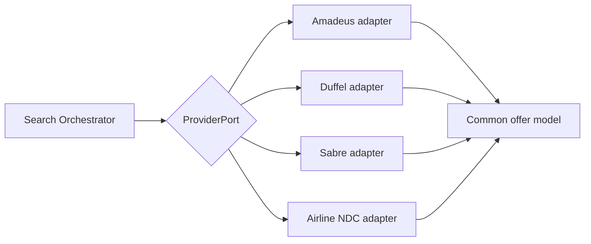

# 13 · Data Providers

_Status: Draft · Owner: Architecture · Last updated: 2026-07-22_

The product's integrity rests on one CLAUDE.md rule: **pricing and availability come from
reliable data providers.** This doc governs how we source, normalize, cache, and fail over
between them. It is a first-class architectural concern, not a subsection of the API strategy.

> **P0 warning (from [CTO Review](../Review/CTO_Review.md) §1/§7).** The adapter pattern is the
> right *engineering* abstraction, but it cannot paper over the *commercial* reality that each
> provider imposes different access tiers, costs, latency, caching/display rights, and booking
> models — and that **getting access at all is non-trivial** (accreditation, volume commitments,
> deposits, seller-of-record requirements). A **[Provider Due-Diligence
> Spike](../Review/provider-due-diligence-spike.md) must precede the build.** The sections below
> now carry that reality.

## 0. Commercial due diligence (do this before designing against any provider)

Engineering effort is wasted if the commercial terms don't work. Before committing to a provider,
answer — per provider — the questions in the
[Due-Diligence Spike](../Review/provider-due-diligence-spike.md):

| Dimension | Why it can kill the plan |
|---|---|
| **Access tier & how to get it** | Amadeus/Sabre *Enterprise* need contracts, accreditation, volume commitments, deposits; *Self-Service* tiers have low limits and non-prod data quirks |
| **Cost per call & rate limits** | Sets `provider_cost_per_call` in the [unit-economics model](../product/02-business-model-gtm.md#2a-per-search-unit-economics--the-make-or-break-model-added-per-review-248) — the make-or-break number |
| **Caching & display rights** | Many agreements **prohibit storing/displaying fares without a live requery** or cap TTLs — this constrains or forbids our "fare cache" (legal, review §5) |
| **Booking model permitted** | Duffel expects you to be seller/agent of record; a pure affiliate handoff may not be supported — this can invalidate [ADR-0003](adr/0003-affiliate-first-booking-model.md) |
| **Native flexible-search support** | Whether the provider offers cheapest-date / flexible endpoints (see §4a) — decides whether we can avoid expensive DIY fan-out |
| **Seller-of-travel / regulatory** | Registration may be required even for affiliates in some jurisdictions (review §5) |

## 1. Provider landscape

| Type | Examples | Pros | Cons |
|---|---|---|---|
| **GDS** | Amadeus, Sabre, Travelport | Broad global inventory, mature | Complex, costly, legacy formats, contracts |
| **Aggregator / API-first** | Duffel, Kiwi (Tequila) | Modern REST, easy integration, NDC + ancillaries | Coverage narrower than full GDS; commercial terms |
| **Airline NDC direct** | Carrier NDC feeds | Rich content, ancillaries, sometimes best price | One integration per airline; effort scales poorly |
| **Fare-data / intelligence** | (price-trend datasets) | Cheap historical trends for "best time to fly" content | Not bookable; advisory only |

**Strategy:** start API-first (fastest to integrate, modern) and add a GDS for coverage. Never
depend on a single provider (NFR-6/11). See ADR-0002 and the final selection in
[Tech Stack §8](24-technology-stack-decisions.md).

> **⚠ 2026 current-events note.** **Amadeus is decommissioning its Self-Service developer portal,
> disabling existing self-service keys in mid-2026.** The easy low-cost self-service on-ramp many
> plans assumed **no longer exists for new integrations** — Amadeus access now means
> **Enterprise/Quick Connect** (contract, likely volume minimums), or an alternative GDS
> (**Travelport**, **Sabre**). This raises the stakes of the
> [due-diligence spike](../Review/provider-due-diligence-spike.md) (risk R22) and likely makes
> **Duffel** the pragmatic API-first primary, with the GDS choice decided by the spike.

## 2. Provider abstraction (the key pattern)
All providers sit behind the domain's `ProviderPort` (doc 07). Each adapter:
- Translates our `NormalizedQuery` → the provider's request.
- Normalizes the provider's response → our common **offer model** (segments, fares, fare rules,
  ancillaries, baggage, cabin, times).
- Exposes `price(offerRef)` for **live re-validation**.
- Reports `healthCheck()` and a `costModel()` (call cost + rate limits) for the query planner.

The domain and optimization engine **never** see provider-specific shapes. Adding/removing a
provider is an adapter change only.

## 3. Normalization challenges (must handle)
- **Baggage & ancillaries** — inclusion differs wildly; must be normalized so they can be priced
  into TTV (FR-16, doc 12). A "cheap" fare with no bag is often not cheapest.
- **Fare rules / change-cancel** — parse into structured, comparable fields.
- **Times/timezones** — normalize to UTC + local; correct duration/layover math.
- **De-duplication** — the same physical itinerary appears across providers at different prices;
  dedupe and keep the best bookable source.
- **Currency** — normalize to a base currency for scoring; display in the user's currency.

## 4. Cost & rate-limit management (business-critical)
Provider calls are the dominant scaling cost (see
[Business Model](../product/02-business-model-gtm.md)). Controls:
- **Cache-first** — Redis fare cache with short, provider-appropriate TTL; `fetched_at`
  recorded; cached prices always labeled and **re-validated live before booking** (NFR-12/14).
- **Cost-aware query planning** — the planner (doc 12) spends a per-search provider-cost budget
  on the queries most likely to change the answer; prunes the rest.
- **Rate-limit governors** per provider (respect their quotas; back off, queue, shed).
- **Provider-cost as a first-class metric** (doc 21) — alert if cost-per-search drifts.
- **ToS/caching-rights compliance** — honor each provider's caching and display terms; never
  cache beyond what contracts allow.

### 4a. Prefer provider-native flexible search over DIY fan-out (biggest cost lever)

> Added per review §9.2 — the single largest architectural cost/latency win. See
> [ADR-0007](adr/0007-native-flexible-search.md).

Naïve flexibility search fans out one provider call per (date × airport × provider) cell — 20–100+
calls per search — which drives both latency (NFR-1) and the dominant cost line. **Where a provider
exposes native flexible/cheapest-date endpoints, use them instead of fanning out:**
- Amadeus **Flight Cheapest Date Search** returns a price grid across dates in one call.
- Kiwi/Tequila supports flexible date/anywhere search natively.
- Several providers offer month-view / price-calendar endpoints.

Strategy: the query planner (doc 12) prefers native-flexible endpoints to enumerate the cheap
regions of the flexibility space in *few* calls, then does **targeted live calls only on the
promising cells** the user might actually book. DIY fan-out is the fallback for providers without
native support. This can cut provider calls per search by an order of magnitude.

## 5. Reliability & failover (NFR-11)
- **Health-checked** adapters; a degraded/over-limit provider is routed around automatically.
- **Graceful degradation** — if a provider is down, serve results from the others + cache and
  label freshness; never a hard error when any results exist.
- **Circuit breakers + timeouts + retries with jitter** on every provider call.
- **Operator dashboard** with manual failover (FR-29).

## 6. Booking handoff & re-validation
- MVP: affiliate/deep-link handoff to the provider/airline (doc 07, GTM doc).
- Before handoff, `price(offerRef)` re-validates against the source; a moved price re-quotes the
  user (FR-21, NFR-12). The exact validated quote is recorded (doc 09 audit log).

## 7. Onboarding a new provider — checklist
1. Implement `ProviderPort` adapter + normalization to the common offer model.
2. Contract tests against the provider sandbox (doc 17).
3. Map costModel (call cost, rate limits) into the query planner.
4. Health check + circuit breaker wired to the failover layer.
5. ToS/caching/display-rights review (legal).
6. Shadow traffic before enabling in the live provider mix (feature-flagged, FR-30).

## 8. Rejected alternatives
- **Single provider** — cheaper to build, but fragile and uncompetitive on coverage/price;
  rejected (ADR-0002).
- **Screen-scraping airline sites** — brittle, often against ToS, legally risky; rejected in
  favor of official provider APIs.
