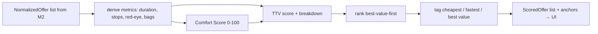

# Milestone 3 — Optimization Engine (Total Trip Value)

_Status: **Ready to build** · Owner: You · Depends on: [M2](milestone-2-flight-search.md) (✅ complete)_

Part of the [Development Roadmap](development-roadmap.md). This is the **current** milestone. It is
the reason Hiddenwing exists — the deterministic engine that ranks trips by value, not just price.

---

## 1. Objective

Replace the placeholder "cheapest first" ordering with a **deterministic Total Trip Value (TTV)**
ranking: score every offer by price **plus** travel time, stops, comfort, and baggage priced-in,
then rank best-value first. Show, for each result, a plain breakdown of *why* it ranked where it
did, and surface the three anchors — **cheapest**, **fastest**, and **best value** — so the user can
see the trade-off frontier and trust the pick.

This is the [Flight Search Optimization design](../architecture/12-flight-search-optimization.md)
built at Family-Edition scale: the same transparent, additive TTV model, minus the large-scale
flexibility fan-out (that's M5) and minus AI (that's M4 — M3 produces the *deterministic* breakdown
text; M4 later makes it conversational).

**Still no AI, no new accounts, no cost.** M3 is pure TypeScript operating on the offers M2 already
returns and snapshots.

## 2. Scope

### In scope
- A **pure optimization module** (`src/domain/optimization/`) with no I/O and no network — trivially
  unit-testable and reproducible ([ADR-0006](../architecture/adr/0006-ai-authority-boundary.md), NFR-13).
- **Default preferences** (a "house" profile): value-of-time, bags needed, stop/red-eye penalties,
  comfort weight. Per-family-member profiles come in **M5** — M3 builds the engine that consumes them.
- **Comfort Score** (deterministic, 0–100) from the fields we actually have: cabin, stops, layover
  length, red-eye, total duration.
- **TTV scoring**: an additive, all-monetary utility with every term **retained in a breakdown**
  (price incl. an estimated bag fee when a fare bundles no bag; time cost; stop penalty; red-eye
  penalty; comfort value).
- **Ranking**: best-TTV first, plus computed **anchors** (cheapest by fare, fastest by duration,
  best value by TTV), and a **delta vs. cheapest** ("best value costs €18 more but saves a stop and
  includes a bag").
- **UI update**: results ordered best-value-first; each card shows a value badge, the anchor tags it
  qualifies for, and a short human-readable reason list; a header explains the ordering.
- **Unit tests** proving the trade-offs (bag-inclusive beats cheaper-bagless; direct beats a stop at
  equal-ish price; red-eye is penalized; anchors are correct).

### Out of scope (later milestones — do NOT build now)
- Per-user **Preference Profiles** and hard-constraint editing (e.g. "never Spirit", "arrive by
  18:00") — **M5**. M3 uses one sensible default profile.
- **Flexibility** search: nearby airports, ± date grid, query planner fan-out — **M5**.
- **AI** natural-language intake and conversational explanations — **M4** (M3's breakdown is the
  grounded data M4 will narrate).
- **Live price re-validation** and booking — **M6**.
- Learned/personalized weights (v2 in doc 12) — later.

## 3. Plan, risks & decisions (per CLAUDE.md)

**The M3 pipeline (all pure, runs in-process after M2's fetch):**



**Key design decisions (and challenges):**

| Decision | Why / trade-off |
|---|---|
| **All-monetary, additive TTV** (not a weighted 0–1 blend) | Makes trade-offs commensurable and *explainable in real units* ("saves 3h but costs €180"). Matches doc 12 and keeps M4's explanations honest. |
| **Deterministic, no LLM in scoring** | Reproducibility, speed, and it's structurally impossible for the ranking to invent a price (ADR-0006). |
| **One default profile in M3** | The engine needs weights; per-user profiles are M5. Building the engine against a default now keeps M3 focused and M5 becomes "supply real weights," not "build the engine." |
| **Price-in the bag** (add an estimated fee when a fare includes fewer checked bags than needed) | This is the single most tangible TTV win: a "cheap" bagless fare is often not cheapest once you need a bag. Uses a *configurable estimate* (we don't have real ancillary prices in test mode). |
| **Don't persist scores** | TTV is a pure function of the snapshot + profile version, so it's recomputable. No schema change, no migration. (We can cache later if needed.) |

**Risks:**

| Risk | Mitigation |
|---|---|
| **Sparse data in Duffel test mode** (no seat pitch, no on-time record) | Comfort Score uses only fields we have (cabin, stops, layover, red-eye, duration) and leaves typed hooks for richer data later. Documented as a known limitation, not a bug. |
| **Currency mixing** | All offers in one search share a currency (provider-returned), and value-of-time is expressed in that same unit, so terms are comparable. Cross-currency normalization is a Scale-Edition concern (doc 13). Noted in code. |
| **Weights feel arbitrary** | Defaults are documented with rationale and are a single, tunable constant; M5 makes them per-user. The breakdown makes every weight's effect visible, so tuning is evidence-based. |
| **Over-penalizing/rewarding** producing weird orders | Unit tests lock in the intended trade-offs; the anchors (cheapest/fastest) always remain visible so a user is never trapped in the engine's opinion. |

**A challenge to our own model:** an additive linear utility can't capture every nuance (e.g.
diminishing returns on time saved). That's acceptable for v1 — it's transparent and debuggable, and
doc 12's v2 explicitly upgrades the *weights*, not the transparency. We ship the honest simple model
first.

## 4. Files affected

```
src/domain/optimization/
├─ preferences.ts     # Preferences type + DEFAULT_PREFERENCES (the house profile)
├─ metrics.ts         # PURE: derive duration/stops/red-eye/bags from a NormalizedOffer
├─ comfort.ts         # PURE: comfortScore(offer, prefs) -> 0..100
├─ ttv.ts             # PURE: scoreOffer(offer, prefs) -> { ttv, comfortScore, breakdown, reasons }
└─ rank.ts            # PURE: rankOffers(offers, prefs) -> { scored[], anchors }

src/features/search/search-service.ts   # CHANGED: rank instead of naive sort; return scored + anchors
src/app/api/search/route.ts             # CHANGED: return { results, anchors, currency }
src/app/search/search-form.tsx          # CHANGED: consume new response shape
src/app/search/results-list.tsx         # CHANGED: "best value first" header + anchors + delta
src/app/search/offer-card.tsx           # CHANGED: value badge, anchor tags, reason list, comfort

tests/unit/
├─ comfort.test.ts    # comfort score monotonicity (direct > 1-stop; business > economy; red-eye down)
└─ ttv.test.ts        # bag-inclusive beats cheaper-bagless; direct beats stop; anchors correct
```

No Prisma/schema change (scores are recomputable — see §3).

## 5. Dependencies
- **M2** (done): the `NormalizedOffer` model and a working search that produces offers.
- **No new packages, no new accounts, no env vars.** Pure computation.
- Feeds **M4** (explanations narrate the breakdown) and **M5** (supplies real per-user `Preferences`).

## 6. Testing requirements

| Type | Test | Passes when |
|---|---|---|
| **Unit** | `comfort.test.ts` | Direct scores higher than 1-stop; business higher than economy; a red-eye lowers the score; output is clamped 0–100. |
| **Unit** | `ttv.test.ts` | A slightly pricier fare **with** a checked bag outranks a cheaper **bagless** one (bag priced in); a direct outranks a same-price 1-stop; a red-eye is penalized; the breakdown terms sum to the reported TTV. |
| **Unit** | `ttv.test.ts` (anchors) | `rankOffers` tags the correct cheapest (by fare), fastest (by duration), and best-value (by TTV) offers; results are ordered best-value-first. |
| **Manual** | Live search | The LHR→JFK search now orders by value; a bag-inclusive direct sits at/near the top; cheapest/fastest tags appear; each card shows a readable reason. |
| **Quality gate** | `npm run test` / build | All unit tests green; typecheck + build pass. |

## 7. Completion criteria (Definition of Done)

- [ ] A pure `src/domain/optimization/` module scores and ranks offers with **no I/O**.
- [ ] **Comfort Score (0–100)** is computed deterministically from available fields.
- [ ] **TTV** is additive and every term is kept in a **breakdown** returned with each offer.
- [ ] **Baggage is priced in**: a fare bundling fewer bags than needed carries an estimated fee.
- [ ] Results are ordered **best-value-first**; **cheapest/fastest/best-value anchors** are computed
      and shown; a **delta vs. cheapest** is displayed.
- [ ] The `/search` UI shows a value badge, anchor tags, and a short **reason list** per offer.
- [ ] **Unit tests pass** locking in the bag/stop/red-eye/anchor trade-offs; typecheck + build pass.
- [ ] Works **locally and on the live Vercel URL** for a real search.
- [ ] Uses **one documented default profile**; no per-user profiles yet (that's M5).

When every box is checked, M3 is done — **then** we detail and start Milestone 4 (AI Layer), which
narrates these deterministic breakdowns in plain language and adds natural-language search intake.

---
### Notes / decisions for M3
- **The engine is the moat, and it's just code** — this is the "maximum quality, near-zero cost"
  promise of the [Family Edition](../FAMILY-EDITION.md) made concrete.
- **Transparent v1 utility**, not a learned ranker — reproducible, explainable, cheap (doc 12 §10).
- **Default weights are a single tunable constant** with documented rationale; M5 personalizes them.
- **No new migration** — scores recompute from the M2 snapshot + profile version.
