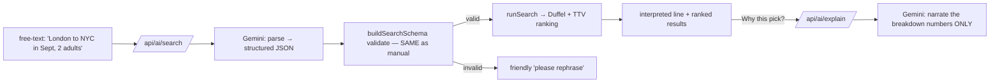

# Milestone 4 — AI Layer (understand & explain)

_Status: **✅ Complete** (2026-07-23, local) · Owner: You · Depends on: [M3](milestone-3-optimization-engine.md) (✅ complete)_

Verified: "cheap flights from London to New York in September for 2 adults" → parsed to
"London (LHR) → New York (JFK), 1 Sep 2026, 2 adults, economy", ranked results, and a grounded
explanation citing only real numbers (€432.70, cheapest, direct, overnight, bag included). Remaining:
add `GEMINI_API_KEY` to Vercel + push for the live site.

Part of the [Development Roadmap](development-roadmap.md). This is the **current** milestone.

---

## 1. Objective

Add AI at the **edges** of the product — never the middle. Two features:

1. **Natural-language intake** — type "cheap flights from London to New York in September" and the
   AI turns it into a **structured search** (airports, dates, passengers, cabin) that runs through
   the *exact same* deterministic validation, search, and TTV ranking we already built.
2. **Grounded explanation** — for the best-value pick, the AI writes a plain-language "why this is
   the best trip for you" **from the deterministic breakdown numbers** — it phrases what the engine
   decided, it never decides anything itself.

This is the [AI-authority boundary](../architecture/adr/0006-ai-authority-boundary.md) made real:
**AI understands and explains; deterministic code owns pricing and ranking.** The AI's output can't
corrupt the product because (a) parsed searches pass through the same zod validation as manual ones,
and (b) explanations are handed the final numbers and told to use only those.

**Provider:** Google **Gemini Flash** (free tier), behind an **AI provider port** so swapping to
Claude or another model later is a one-file change — same pattern as our flight provider (ADR-0002).

## 2. Scope

### In scope
- An **`AiPort`** interface (`src/domain/ai/`) with `parseTripRequest()` and `explain()` — provider-
  agnostic; the app depends on it, not on Gemini.
- A **Gemini adapter** (`src/features/ai/gemini/`) using the `@google/genai` SDK with **structured
  JSON output** for parsing and a grounded text prompt for explanations. Server-only key.
- **`POST /api/ai/search`**: text → parse → **validate via the existing `buildSearchSchema`** →
  `runSearch` (M2+M3) → return the interpreted query, the results, and anchors. A bad parse returns a
  friendly "couldn't understand that" — it can never run an invalid search.
- **`POST /api/ai/explain`**: the best-value scored offer + query → a 2–3 sentence grounded
  explanation using only the supplied numbers.
- **UI**: a natural-language box above the structured form ("Describe your trip"), an "I understood:
  …" confirmation line, and a "Why this pick?" button on the results that shows the explanation.
- **Env**: `GEMINI_API_KEY` (server-only) and optional `GEMINI_MODEL`.

### Out of scope (later)
- Per-user preference profiles & flexibility search — **M5**.
- Price re-validation & booking — **M6**.
- Airport autocomplete dropdown — largely **obviated** by natural-language search; if still wanted,
  it's a small **M5/M6** polish item ([UX plan](../product/25-ux-and-searchability-plan.md)).
- Multi-turn chat / conversational memory — not needed yet; single-shot parse + explain.
- Letting the AI rank, price, or choose flights — **explicitly forbidden** (ADR-0006).

## 3. Plan, risks & decisions (per CLAUDE.md)



| Decision / risk | Handling |
|---|---|
| **AI must not hallucinate a search** (wrong airport, past date) | The parsed JSON goes through the **same `buildSearchSchema`** as the manual form. Invalid → friendly error, never a bad search. Structural safety, not trust. |
| **AI must not invent prices/times in explanations** | `explain()` receives the already-computed numbers and is instructed to use **only** those; it produces prose, never data. The displayed prices/ranking always come from the deterministic engine, regardless of what the text says. |
| **Ambiguous cities** ("London" = LHR/LGW/…) | Prompt instructs Gemini to return the **primary international airport IATA code**; the user sees the interpreted line and can correct via the manual form. |
| **Free-tier limits / provider outage** | Family volume is far under Gemini's 1,500/day. If the AI call fails, the **manual form still works** — AI is additive, never required. Errors degrade gracefully. |
| **Vendor lock-in** | Everything sits behind `AiPort`; switching to Claude/Groq is a new adapter + env var. Matches the flight-provider pattern. |
| **Privacy** (Gemini free tier may train on prompts) | Documented; prompts contain trip requests + public flight data, no secrets. Upgrade path (paid Gemini / Claude / Bedrock) removes training use when it matters (doc 24). |

**Challenge:** should explanations be generated for *every* result up front? No — that's N API calls
per search for text nobody may read. We generate **on demand** for the pick the user asks about.
Cheaper, faster, and the explanation that matters most is "why the top one."

## 4. Files affected

```
src/domain/ai/
└─ ai-port.ts                    # AiPort interface + ParsedTripRequest / ExplainInput types

src/features/ai/gemini/
├─ gemini-client.ts              # GoogleGenAI factory (server-only, reads GEMINI_API_KEY)
├─ prompts.ts                    # system prompts: intake + grounded explanation
└─ gemini-adapter.ts             # implements AiPort with structured output

src/app/api/ai/
├─ search/route.ts               # text → parse → validate → runSearch → results
└─ explain/route.ts              # best offer + query → grounded explanation

src/app/search/
├─ page.tsx                      # CHANGED: render the combined panel
├─ search-panel.tsx              # NEW client panel: NL box + manual form + shared results
└─ results-list.tsx             # CHANGED: "Why this pick?" → /api/ai/explain
src/app/api/search/route.ts      # CHANGED: also return the query used (for explain context)

.env.example                     # + GEMINI_API_KEY, GEMINI_MODEL
.env.local                       # + GEMINI_API_KEY (your free key)
package.json                     # + @google/genai
```

## 5. Dependencies
- **M3** (done): `runSearch` returns scored offers + anchors + breakdowns to explain.
- **Package**: `@google/genai`.
- **Account**: a free **Google AI Studio** API key (no credit card) → `GEMINI_API_KEY`.
- Feeds **M5** (the AI can later read preference profiles) and is unaffected by **M6**.

## 6. Testing requirements

| Type | Test | Passes when |
|---|---|---|
| **Unit** | parsed-output validation | A well-formed AI JSON maps to a valid `NormalizedQuery`; a malformed/past-date one is rejected by `buildSearchSchema` (reuses M2 schema tests — no live AI call). |
| **Unit (mock)** | `AiPort` contract | The service calls `parseTripRequest`, feeds the result through validation, and only searches on success (Gemini mocked — no network in tests). |
| **Manual** | NL search | "London to New York in September, 2 adults" returns ranked results with a correct interpreted line. |
| **Manual** | Explanation grounding | "Why this pick?" produces 2–3 sentences that match the shown numbers and invents nothing. |
| **Quality gate** | `npm run test` / build | Green; no live AI calls in CI. |

## 7. Completion criteria (Definition of Done)

- [x] `AiPort` exists in `domain/`; the app depends on it, not on Gemini directly.
- [x] A **Gemini adapter** parses free text to structured search params and writes grounded
      explanations, with `GEMINI_API_KEY` **server-only**.
- [x] `POST /api/ai/search` parses → **validates via `buildSearchSchema`** → runs the real
      search+ranking; invalid parses fail **friendly**, never as a bad search.
- [x] `POST /api/ai/explain` returns a grounded 2–3 sentence explanation using **only** supplied
      numbers (verified: €432.70, cheapest, direct, overnight, bag — nothing invented).
- [x] The `/search` UI has a natural-language box, shows an **interpreted** line, and a **"Why this
      pick?"** explanation — with the manual form still fully working.
- [x] AI is **additive**: if the AI fails or the key is missing, manual search still works.
- [x] Works **locally**; deploy to Vercel pending the `GEMINI_API_KEY` env var + push.
- [x] `.env.example` documents `GEMINI_API_KEY`; no secrets committed.

When every box is checked, M4 is done — **then** Milestone 5 (Personalization & Flexibility): per
family-member preference profiles that feed the TTV weights, plus nearby-airport / flexible-date
search.

---
### Notes / decisions for M4
- **AI at the edges, grounded** — the trust feature and a coding discipline, not a cost
  ([Family Edition](../FAMILY-EDITION.md), ADR-0006).
- **Gemini Flash (free) behind a port** — quality where it's easy (parse + phrase), determinism
  where it matters (rank + price); swappable to Claude in one file (doc 24 upgrade path).
- **Validation is the safety net** — the AI proposes; `buildSearchSchema` disposes.
