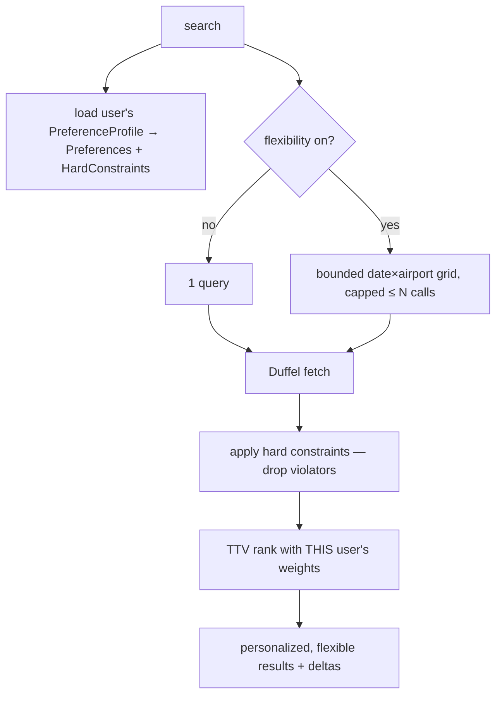

# Milestone 5 — Personalization & Flexibility

_Status: **Ready to build** · Owner: You · Depends on: [M4](milestone-4-ai-layer.md) (✅ complete)_

Part of the [Development Roadmap](development-roadmap.md). This is the **current** milestone. It is
built in two sub-parts: **M5a Preference Profiles** (build first), then **M5b Flexibility Search**.

---

## 1. Objective

Make the ranking **personal** and the search **flexible**.

- **M5a — Preference Profiles:** each family member has a saved profile that feeds the **same TTV
  weights** the engine already uses (value-of-time, bags needed, comfort weight, red-eye and stop
  penalties) plus a few **hard constraints** ("never a red-eye", "max 1 stop"). The ranking then
  reflects *that person's* definition of value — Dad's results differ from Mum's.
- **M5b — Flexibility Search:** optionally widen a search across **nearby airports** and **± a few
  days**, run a **bounded** set of provider queries, merge, de-duplicate, and rank the combined set —
  surfacing "fly a day earlier from Gatwick and save €120" style wins.

This realizes two Family-Edition "keep" features (the profile magic and flexibility) on top of the
deterministic engine, still with **no new paid services**.

## 2. Scope

### In scope — M5a (build first)
- A **`PreferenceProfile`** table, one row per user (keyed by Clerk id), storing the TTV weights +
  hard constraints. Sensible defaults; every field editable.
- A **profile repo** that loads a user's profile into the existing `Preferences` object (falling
  back to `DEFAULT_PREFERENCES`) and a `HardConstraints` object.
- **Hard-constraint filtering** (pure): drop offers that violate "no red-eye" / "max N stops"
  *before* ranking, with a count of how many were filtered.
- **Wire the profile into search**: `/api/search` and `/api/ai/search` load the signed-in user's
  profile and pass it to `runSearch` — so results are personalized automatically.
- A **`/profile`** page (protected) to view and edit the profile, saved via `/api/profile`.
- A link to the profile from the dashboard/search.

### In scope — M5b (build second)
- **Opt-in flexibility** controls on the search form: "± N days" (0–3) and "include nearby
  airports" (a small, curated nearby-airport map for common hubs; expandable later).
- A **bounded fan-out planner**: expand the date × airport grid but **cap total provider calls**
  (e.g. ≤ 9) to protect latency and cost; run concurrently; merge + de-duplicate offers.
- Results show the **winning date/airport** per option and the **delta vs. the literal query** — the
  "north-star moment" (FR-18).

### Out of scope (later)
- Live price re-validation & booking handoff — **M6**.
- Learned/behavioural weights (v2 of the TTV model, doc 12 §9) — later.
- Provider-native cheapest-date grids (Duffel lacks them; DIY bounded fan-out is our M5b approach,
  [ADR-0007](../architecture/adr/0007-native-flexible-search.md)).
- Full airport autocomplete dropdown — optional; NL search already covers most of it. If added, it
  slots in here as UI polish ([UX plan](../product/25-ux-and-searchability-plan.md)).

## 3. Plan, risks & decisions (per CLAUDE.md)



| Decision / risk | Handling |
|---|---|
| **Hard vs soft preferences** | Soft = weights that *tilt* the score (existing). Hard = filters that *eliminate* (new). "Never red-eye" as hard removes them; as soft just penalizes. The profile lets the user pick. (doc 12 §5) |
| **Flexibility explodes provider calls** (cost/latency) | A **hard cap** on total calls (bounded grid), concurrency, and de-duplication. Family volume stays tiny; the cap protects against a pathological "± 3 days × 4 airports" blow-up. Documented, tunable. |
| **Nearby-airport data** | A small curated map for common cities (no new dependency). Good enough for a family; a real airport dataset is a later upgrade. |
| **Profile must never break search** | Missing/partial profile → merge over `DEFAULT_PREFERENCES`. A bad value can't crash a search; validation on save. |
| **Personalization changes results silently** | The results always show the active constraints ("filtered 12 red-eyes") and the anchors remain, so the user understands *why* they see what they see. |
| **Determinism preserved** | Ranking stays a pure function of `(offers, profile_version)` — profiles are just the weights, versioned conceptually. AI still never ranks (ADR-0006). |

**Challenge — should the AI edit the profile from chat ("I hate red-eyes")?** Tempting, but M5
keeps profile editing **deterministic and explicit** (a form). Letting the AI mutate saved
preferences is an M4-boundary risk and a later, opt-in feature. Keep the profile user-owned for now.

## 4. Files affected

**M5a — profiles**
```
prisma/schema.prisma                         # + PreferenceProfile model → migration
src/domain/optimization/constraints.ts       # NEW pure: HardConstraints + applyHardConstraints()
src/features/profile/profile-repo.ts         # load/save profile → Preferences + HardConstraints
src/lib/validation/profile-schema.ts         # zod validation for profile edits
src/features/search/search-service.ts        # CHANGED: accept + apply hard constraints
src/app/api/search/route.ts                  # CHANGED: load user profile
src/app/api/ai/search/route.ts               # CHANGED: load user profile
src/app/api/profile/route.ts                 # NEW: GET current profile, POST save
src/app/profile/page.tsx                     # NEW protected page
src/app/profile/profile-form.tsx             # NEW client editor
src/app/dashboard/page.tsx                   # CHANGED: link to /profile
tests/unit/constraints.test.ts               # hard-filter behaviour
```

**M5b — flexibility**
```
src/domain/search/flexibility.ts             # NEW pure: expand bounded date×airport grid
src/features/search/nearby-airports.ts       # NEW: small curated nearby-airport map
src/features/search/search-service.ts        # CHANGED: fan-out + merge + dedupe when enabled
src/app/search/search-panel.tsx              # CHANGED: ± days + nearby toggle
tests/unit/flexibility.test.ts               # grid expansion + cap
```

## 5. Dependencies
- **M2/M3/M4** (done): provider, TTV engine, AI.
- **No new packages, no new accounts.** One Prisma migration (the profile table).
- Feeds **M6** (the profile is part of what launch-hardening protects).

## 6. Testing requirements

| Type | Test | Passes when |
|---|---|---|
| **Unit** | `constraints.test.ts` | "no red-eye" removes red-eyes; "max 1 stop" removes 2+-stop offers; empty constraints keep everything. |
| **Unit** | `flexibility.test.ts` | The grid expands to the expected cells and is **capped** at the max; no duplicates. |
| **Unit (mock)** | profile → search | A saved profile changes which offer is "best value" vs the default (e.g. a high value-of-time promotes the faster option). |
| **Manual** | Profile edit | Setting "never red-eye" then searching LHR→JFK removes the overnight options and re-ranks. |
| **Manual** | Flexibility | "± 2 days, nearby airports" surfaces a cheaper/earlier option with a visible delta. |
| **Quality gate** | `npm run test` / build | Green; no live calls in tests. |

## 7. Completion criteria (Definition of Done)

**M5a — ✅ complete (2026-07-23, local)**
- [x] `PreferenceProfile` table exists; migration applied (`add_preference_profile`).
- [x] `/profile` lets a user view/edit weights + hard constraints; saves validated.
- [x] Search loads the signed-in user's profile and **ranks with their weights**; missing profile
      falls back to defaults.
- [x] Hard constraints **filter** offers before ranking; the UI notes how many were removed
      (verified: "74 options hidden by your preferences", red-eyes gone, top pick became daytime).
- [x] `constraints.test.ts` passes (33/33 tests green); works locally. _(Push for live.)_

**M5b**
- [ ] The form offers **± N days** and **nearby airports** (opt-in).
- [ ] Flexibility fan-out is **bounded/capped**, concurrent, merged, and de-duplicated.
- [ ] Results show the **winning date/airport** and **delta vs. the literal query**.
- [ ] `flexibility.test.ts` passes; works locally and deployed.

When both are done, M5 is complete — **then** Milestone 6 (Polish, Price-Integrity & Launch): live
price re-validation before any booking handoff, the visual/responsive polish pass, maps/distances/
logos, and readying it for real family use.

---
### Notes / decisions for M5
- **Profiles feed the existing weights** — M3 built the engine *to consume a profile*; M5 supplies
  real ones. No engine rewrite, exactly as planned.
- **Hard vs soft** is the key personalization primitive (eliminate vs tilt).
- **Bounded flexibility** — the one place family-scale could accidentally spike provider calls, so
  it's explicitly capped.
