# 20 · Deployment Strategy

_Status: Draft · Owner: DevOps · Last updated: 2026-07-22_

## 1. Goals
Safe, frequent, reversible deployments; reproducible infrastructure; the scale/availability NFRs
(NFR-5/8/9); security shifted left (doc 15).

## 2. Environments
| Env | Purpose | Data |
|---|---|---|
| **Local/dev** | Developer machines; docker-compose for Postgres/Redis/OpenSearch | Synthetic |
| **CI** | Automated test/build on every PR | Ephemeral test containers |
| **Staging** | Prod-like; E2E, load, security, provider **sandboxes** | Seeded, no real PII |
| **Production** | Live | Real (encrypted, GDPR-governed) |

Prod-like staging is non-negotiable — provider integrations and async search behave differently
under realistic conditions.

## 3. Infrastructure as Code
- **Everything in Terraform** (network, cluster, DBs, secrets wiring, DNS). No click-ops in prod.
- Modular, versioned, reviewed; plan output on PRs; state locked and remote.
- Config-scanning (tfsec/checkov) in CI (doc 15, A05).

## 4. Containers & orchestration
- Services containerized (hardened, non-root, minimal base, read-only FS where possible).
- **Kubernetes** for orchestration (autoscaling, rolling updates, self-healing). Managed cluster
  on a major cloud; portability kept via standard K8s + Terraform (ADR path if we ever move).
- Image scanning + signing; admission control rejects unsigned/vulnerable images.

## 5. CI/CD pipeline

```mermaid
flowchart LR
  PR[Pull request] --> LINT[Lint + typecheck]
  LINT --> TEST[Unit + integration + contract]
  TEST --> PRICE[Pricing-integrity suite]
  PRICE --> AIEVAL[AI eval gates]
  AIEVAL --> SEC[SAST + deps + secrets + IaC scan]
  SEC --> BUILD[Build + sign image]
  BUILD --> STAGE[Deploy to staging]
  STAGE --> E2E[E2E + smoke + perf smoke]
  E2E --> APPROVE{Gate}
  APPROVE --> PROD[Progressive prod rollout]
```

Merge is blocked unless all gates pass (see [Testing §10](17-testing-strategy.md)). Trunk-based
development with short-lived branches and protected `main`; signed commits.

## 6. Release strategy
- **Progressive delivery**: canary → percentage rollout → full, watching SLOs/error budget
  (doc 21). Auto-rollback on SLO/error-budget breach.
- **Blue-green** for risky infra/DB-adjacent changes.
- **Feature flags** decouple deploy from release; used for search params, provider mix, and new
  AI prompts/models (FR-30) — instant kill-switch without redeploy.
- **DB migrations**: forward-only, backward-compatible (expand/contract) so rollbacks are safe
  (doc 09).

## 7. Configuration & secrets
- Config via env/config service, not baked into images; per-env.
- Secrets only from the secrets manager (doc 15); rotated; never in the image or repo.

## 8. Scaling & resilience in prod
- **Horizontal autoscaling** on queue depth/concurrency (search is bursty — NFR-7), not just CPU.
- Multi-AZ; multi-region readiness for residency + availability (NFR-8/18).
- **DR**: automated backups, tested restores; RPO ≤ 5 min, RTO ≤ 30 min (NFR-10). Game-days.
- Graceful degradation wired to provider failover (doc 13, NFR-11).

## 9. Rollout of AI changes (special case)
Prompt/model changes go through the eval gate (doc 11), ship behind a flag, roll out canary-first
with the guardrail-rejection-rate watched; instant flip-back if grounding metrics regress.

## 10. Cost controls in deployment
- Spot/preemptible capacity for stateless search workers; right-sizing; autoscale-to-baseline
  off-peak. Provider-cost and LLM-cost dashboards gate risky changes (GTM doc, doc 21).

## 11. Rejected alternatives
- **Serverless-only** — cold starts, long async searches, and provider connection pooling favor a
  container platform; serverless kept for glue/edge (doc 07).
- **Manual/click-ops infra** — non-reproducible, error-prone; everything is IaC.
